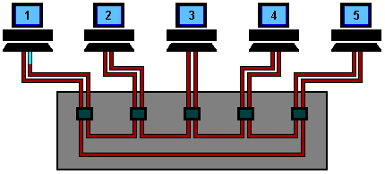

# Simple Distributed Pub/Sub

## [Token Ring](https://en.wikipedia.org/wiki/Token_Ring)

Token Ring is a [computer networking](https://en.wikipedia.org/wiki/Computer_network) technology used to build [local area networks](https://en.wikipedia.org/wiki/Local_area_network). It was introduced by [IBM](https://en.wikipedia.org/wiki/IBM) in 1984, and standardized in 1989 as [IEEE](https://en.wikipedia.org/wiki/IEEE_Standards_Association) 802.5.

It uses a token that is passed around a logical ring of workstations or servers. This [token passing](https://en.wikipedia.org/wiki/Token_passing) is a [channel access method](https://en.wikipedia.org/wiki/Channel_access_method) providing fair access for all stations, and eliminating the [collisions](https://en.wikipedia.org/wiki/Collision_(telecommunications)) of [contention](https://en.wikipedia.org/wiki/Contention_(telecommunications))-based access methods.



## Broker example

```
java -jar Broker.jar
```

## Client example

```
java -jar Executavel.jar -m 1 -bp 8084 -bkp 8082 -ipc 10.158.0.6 -ip 10.158.0.2 -mc 3
```

## Client arguments

| Arg  | Type    | Description          | Default     |
|------|---------|----------------------|-------------|
| -m   | Integer | Machine id           | -           |
| -bp  | Integer | Client port          | 8081        |
| -bkp | Integer | Broker port          | 8080        |
| -ipc | String  | Client IP            | "localhost" |
| -ip  | String  | Broker IP            | "localhost" |
| -mc  | Integer | Quantity of machines | 5           |
