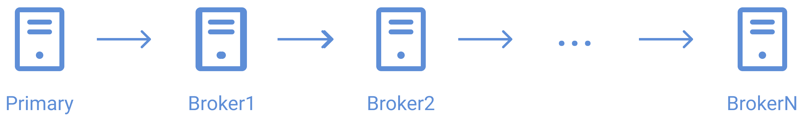

# Simple Distributed Pub/Sub Replicated
## Protocolos
### Protocolo de gerenciamento de mensagens:

Se baseia em filas para o tratamento de concorrência dos recursos. Cada recurso possui uma fila de prioridade indicando qual o próximo cliente
a recebê-lo baseado na ordem de requisições. Cabe ao servidor realizar o controle de qual recurso está sendo utilizado no momento e liberá-lo para outro
cliente se e somente se ele não estiver sendo utilizado no momento.

```json
{ 
    "available": 5, 
    "content": "b",
    "queue": []
}
```

| chave | tipo | descrição |
| ----- | ---- | --------- |
| available | bool | indica se o recurso está disponível ou não, ou seja, se está sendo processado por algum cliente no momento de verificação |
| content | string | conteúdo do recurso em si. É isso que o cliente recebe e manda para o servidor |
| queue | array | fila de prioridade que define a ordem dos clientes a alterarem o recurso |

> A concorrência é tratada com a logística FIFO (First in, First out), evitando conflito de informações e processamentos errados.

### Protocolo de backup de servidores:

O protocolo de backup serve para garantir uma maior resiliência das conexões, onde se um servidor cair ou parar de funcionar, as chances de ter outro para
cobrir suas funcionalidades serão grandes.
O sistema funciona da seguinte forma: Em um conjunto de servidores com n brokers, todos estarão referenciados em uma lista encadeada. A atualização de backup
será feita percorrendo tal lista encadeada, onde o broker 1 atualiza o broker 2, o broker 2 atualiza o broker 3 e assim por diante, sabendo que o broker de
menor índice sempre será o mais atualizado durante esse processo. Essa atualização ocorre periodicamente no sistema.

Considere o seguinte sistema de brokers:

<p align="left">
    
</p>

Tem-se N brokers. Segundo as propriedades decididas pelo protocolo, o primeiro da lista sempre será o principal, ou seja, aquele que se comunica com os clientes.
Periodicamente haverá backups, portanto, o broker B1 irá atualizar B2, B2 irá atualizar B3 ... até Bn.
Em cada cliente haverá uma lista indicando os dados para conexão de cada broker na mesma ordem mostrada acima. Então, caso o broker principal B1 caia, 
um timeout irá acontecer e os clientes automaticamente tentarão se conectar a B2, caso a conexão de B2 não seja bem-sucedida, o cliente tenta B3, e assim por
diante até Bn

## Mensagens

- ### MESSAGETYPE.ACQUIRE:
	Requisição do recurso feita pelo cliente para o servidor. O cliente requisita um recurso específico e espera um MESSAGETYPE.ACQUIRERESPONSE como
	retorno do servidor.

    ```json
    { 
        "resourcePosition": 5, 
        "clientId": "client2" 
    }
    ```

    | chave | tipo | descrição |
    | ----- | ---- | --------- |
    | resourcePosition | int | indica a posição do recurso na lista de recursos da base de dados do servidor |
    | clientId | string | indica o nome do cliente que está requisitando o recurso |

	> Resposta: MESSAGETYPE.ACQUIRERESPONSE
	
- ### MESSAGETYPE.ACQUIRERESPONSE:
	Resposta para a requisição do recurso feita pelo servidor para o cliente. O servidor responde para o cliente se o recurso está disponível para
	ser utilizado ou não, seguido do recurso em si caso esteja disponível

    ```json
    { 
        "available": true, 
        "resource": {
            "content": "b"
        }
    }
    ```
    
    | chave | tipo | descrição |
    | ----- | ---- | --------- |
    | available | bool | indica se o recurso está liberado para ser utilizado para o cliente em questão |
    | resource | object | o conteúdo do recurso em sí |

	> Resposta: MESSAGETYPE.ACK

- ### MESSAGETYPE.ACK:
	Mensagem para sinalizar o recebimento de outra mensagem. Um acknowledgement

    ```json
    { 
        "statusCode": "ok", 
    }
    ```

    | chave | tipo | descrição |
    | ----- | ---- | --------- |
    | statusCode | string | indica o status do recebimento |

	> Resposta: -

- ### MESSAGETYPE.RELEASE:
	Resposta do cliente para o servidor em relação ao processamento do recurso recebido anteriormente. É feita após o recurso em questão ser processado
	e/ou alterado pelo cliente, então é enviado um sinal de release para o servidor para que assim libere o recurso para outros clientes.

    ```json
    { 
        "resourcePosition": 5, 
        "resource": {
            "content": "b"
        }
    }
    ```

    | chave | tipo | descrição |
    | ----- | ---- | --------- |
    | resourcePosition | int | indica a posição do recurso na lista de recursos da base de dados do servidor |
    | resource | object | o conteúdo do recurso em sí |

	> Resposta: MESSAGETYPE.ACK

- ### MESSAGETYPE.INFOCLIENT:
	Resposta do cliente para o servidor informando dados para seu armazenamento na lista de sockets do servidor. É a primeira mensagem enviada após a
	conexão.

    ```json
    { 
        "socketName": "client2", 
    }
    ```
	
    | chave | tipo | descrição |
    | ----- | ---- | --------- |
    | socketName | string | nome do cliente para ser armazenado na lista de sockets do servidor |

	> Resposta: MESSAGETYPE.UPDATEBROKER

- ### MESSAGETYPE.INFOBROKER:

- ### MESSAGETYPE.UPDATEBROKER:

## Execução

```sh
npm install
```

### Broker

| argumento | descrição |
| --------- | --------- |
| brokerName | o nome identificador do broker |
| port |  a porta do broker |
| mainHost | o host do broker principal a ser conectado  |
| mainPort | a porta do broker principal a ser conectado  |

Linux
```sh
npm debug-server brokerName port mainHost mainPort  
```

Windows
```sh
npm windows-debug-server brokerName port mainHost mainPort 
```

> O primeiro broker deve ser o primário e para isso é necessário executar o comando demonstrado acima omitindo os argumentos mainHost e mainPort. Esses argumentos só devem ser passado caso o broker seja secundário e já exista um broker primário.

### Cliente

| argumento | descrição |
| --------- | --------- |
| clientName | o nome identificador do cliente |
| brokerHost | o host do broker a ser conectado |
| brokerPort | a porta do broker a ser conectado |

Linux
```sh
npm debug-client clientName brokerHost brokerPort
```

Windows
```sh
npm windows-debug-client clientName brokerHost brokerPort
```
   
